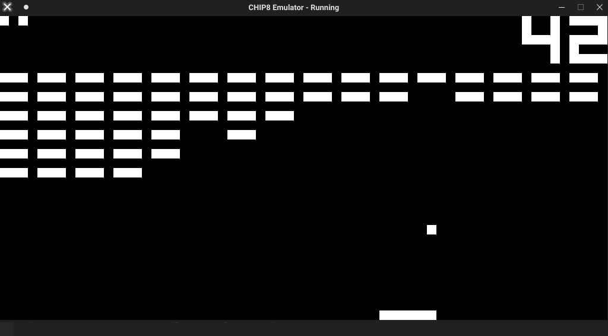

# chip8-emulator
CHIP-8 emulator written in C with SDL2 for graphics and sound.




CHIP-8 is an interpreted programming language for microcomputers from the mid-1970s.
Programs are run on a CHIP-8 virtual machine. 
This repository contains my implementation of the virtual machine for Linux.

# ROMS
This repo contains "Chip-8 Games Pack" from https://www.zophar.net/pdroms/chip8/chip-8-games-pack.html.

# Dependencies
  * SDL2
  * SDL2_mixer

# Installation on Linux
  * Install dependencies
  ```
   (On Debian based systems)
   sudo apt install libsdl2-2.0-0 libsdl2-mixer-2.0-0
  ```
  * Extract the included c8games.zip
  * Compile:
  ```
  gcc -fcommon *.c -lSDL2 -lSDL2_mixer -o chip8
  ```
  * Select a rom from the extracted zip, and run:
  ```
  ./chip8 <OPTIONS> <ROM>
  
  For example:
  ./chip8 c8games/BRIX
  ```
  
# Options
  * -i: run with old instruction mode. Use this option to fix problems in some games (some of them assume a different implementation)
  * -w: run without screen wrapping. By default the graphics are wrapped. However, some games don't use wrapping.
  * -s: silent mode. run without sound.
 
# In-game controls
  * CHIP-8 uses a hex keyboard. Here is the mapping between virtual keys and actual controls:
  
  ```
  VIRTUAL KEYS         QWERTY KEYBOARD
  
  1 2 3 c              1 2 3 4
  4 5 6 d       =>     Q W E R
  7 8 9 e              A S D F
  a 0 b f              Z X C V
  ```
  
  * [P] - Pause
  * [O] - Toggle sound
  * [I] - Restart game
